# The Hoppertron Inc Team proudly presents our Hackathon Project "Frogs of Fury"

Welcome to Frogs of Fury, a retro-inspired action game that pays homage to the classic "Contra" while offering a fresh, vertical challenge. In this game, players must navigate their way through an endless vertical landscape by leaping from platform to platform, all while avoiding or defeating various enemies. The higher you go, the more perilous the journey becomes. But beware: the map dissolves beneath you, so any missed jump or hesitation could lead to your demise. Whether playing solo or with a friend in co-op mode, your goal is to ascend as high as possible and survive the relentless challenges thrown your way.

The live link for Frogs of Fury can be found here - [Frogs of Fury](https://erikas-ramanauskas.github.io/team_9_august_2024/)

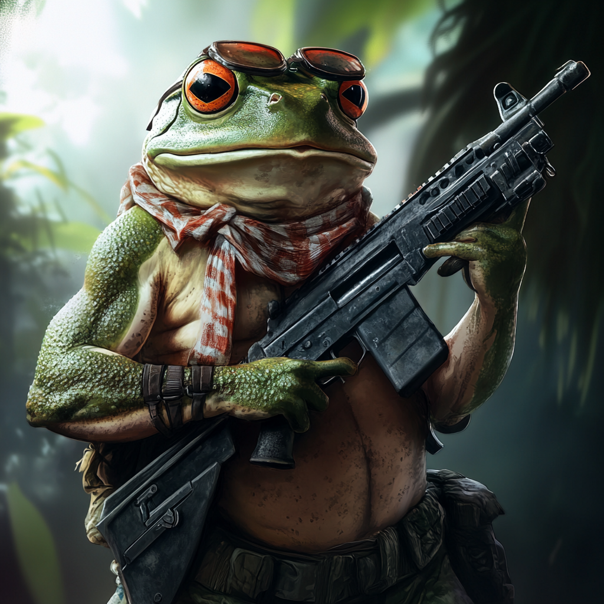

# Objectives

- **Climb the vertical landscape** by leaping across platforms.
- **Defeat enemies** that block your ascent.
- **Survive as long as possible** by outmaneuvering enemies and avoiding the dissolving platforms.
- **Cooperate in 2-player mode** to reach even higher and share the adventure

# UX

## Target Audience

This game is designed for retro game enthusiasts who enjoy fast-paced, skill-based challenges. It appeals to both nostalgic players who grew up with classic arcade games and modern gamers looking for a fresh take on old-school platformers. Additionally, this game targets players who enjoy cooperative play, offering a shared challenge with friends or family members.

## User Stories

1.  **As a solo player**, I want to challenge myself to climb as high as I can while overcoming increasingly difficult enemies and platforming obstacles.
2.  **As a cooperative player**, I want to team up with a friend to help each other through tricky sections and see how far we can climb together.
3.  **As a casual gamer**, I want a quick and fun gameplay experience that I can enjoy in short bursts but offers enough depth to keep me coming back.
4.  **As a competitive gamer**, I want to see how high I can get compared to my previous runs and other players, pushing myself to improve with each game.
5.  **As a retro game fan**, I want to enjoy the nostalgic feel of classic 2D platformers with pixel art and simple, yet engaging mechanics.

## Site Aims

- **Simple and Fun**: Deliver a straightforward, enjoyable game that is easy for all users to pick up and play.
- **Challenge**: Provide a steadily increasing difficulty to keep players engaged and motivated to improve.
- **Retro Appeal**: Capture the essence of classic arcade games with a nostalgic visual and audio design.
- **Accessibility**: Ensure the game is intuitive, with simple controls and clear objectives, so players can focus on the action.

# Design

## Color Scheme

### HTML pages

The HTML pages for "Frog of Fury" employ a dark and vibrant color scheme designed to enhance the game's retro atmosphere while maintaining readability and focus.

- **Primary Colors:** The overall background uses a deep, almost black shade (#00000b), creating a stark contrast with bright elements.
- **Accent Colors:** Vivid green (#00ff00) is used for borders and highlights, adding a neon-like glow emphasizing interactive elements.
- **Text and Backgrounds:** White (#ffffff) and slightly off-white tones are used for text and background panels to ensure clarity against the dark background, with subtle shadow effects adding depth.

### Characters

The characters in "Frog of Fury" are designed with distinct color palettes that emphasize their roles and enhance the visual contrast against the game’s environments.

- **Player 1:** The character sprites use dark tones (#02060A) with vibrant highlights, ensuring visibility against diverse backgrounds.
- **Player 2 Variant:** This sprite has a unique color scheme dominated by dark purples (#390062), differentiating it from the primary character.
- **Mosquito:** The mosquito sprites feature sharp contrasts with black (#000000) and light cyan tones (#E3F7EB) to stand out as enemies.
- **Snake:** The snake sprite combines deep blacks (#000000) with electric blues (#0A50FF), giving it a cold, mechanical feel.

### Gameplay Map

The color scheme for "Frog of Fury" draws heavily from natural and earthy tones, combined with bright, contrasting colors that enhance the retro gaming feel.

- **Dirt Tile:** A range of warm browns (e.g., #9C5A3C) gives the game environment a grounded, earthy feel. These shades provide a natural look, reminiscent of soil and dirt.
- **Lava Tile:** Vivid oranges and reds (e.g., #EF6C00, #FFA726) dominate this tile, capturing the intense heat and danger associated with lava. These colors contrast sharply with the other more muted tones.
- **Platform Tile:** Shades of green (e.g., #4CAF50, #22B14C) are used, evoking the lushness of nature. This green palette is critical for representing the platforms and safe zones the player interacts with.
- **Wall Tile:** Muted browns and dark grays (e.g., #4A312B, #6B473D) provide a solid, sturdy appearance, reinforcing the feeling of immovable obstacles in the game.

See all our used color schemes screenshots

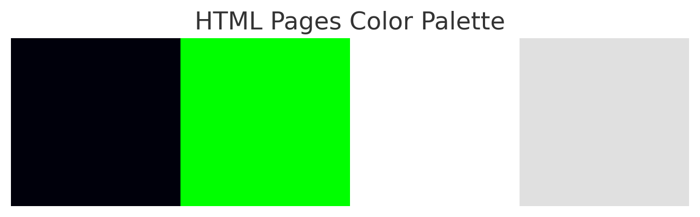
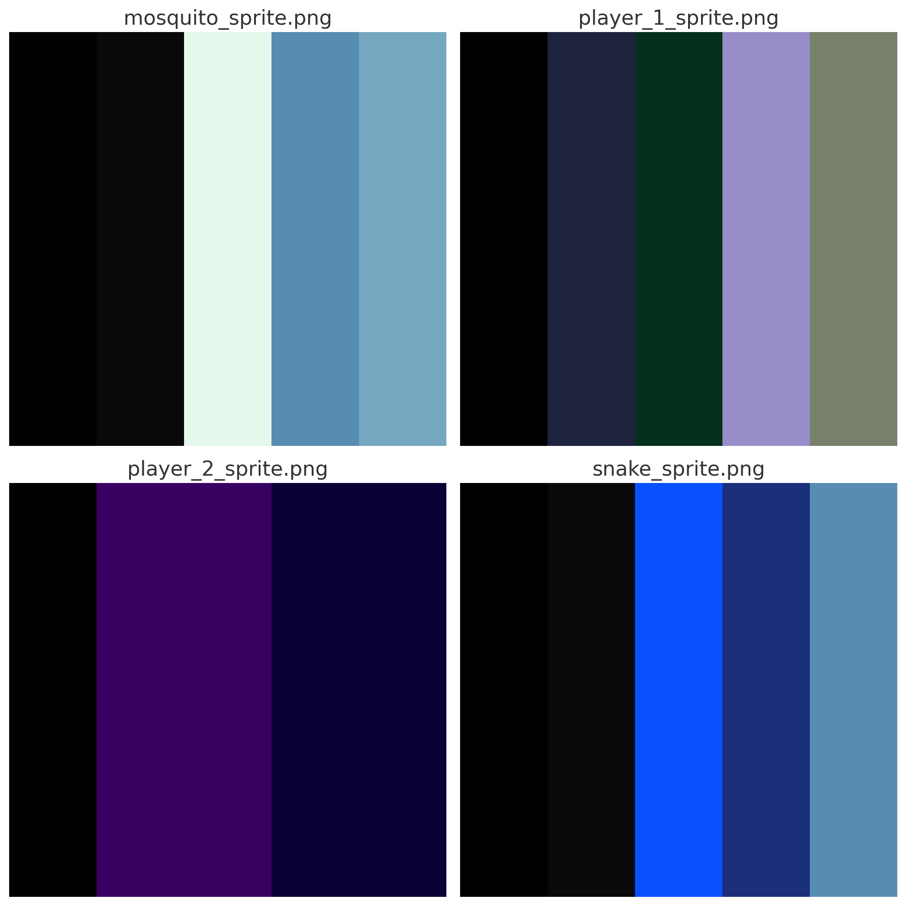
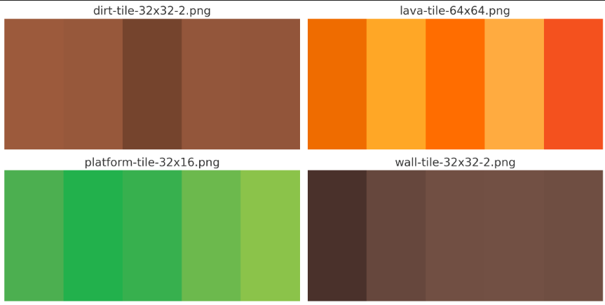

## Typography

The game’s typography is straightforward and functional, adhering to a clean and modern sans-serif style. The primary font used is Arial, which provides clarity and readability across various screen sizes. The use of sans-serif fonts complements the retro aesthetic of the game, ensuring that text elements do not distract from the intense action of the gameplay. Buttons and navigation links feature bold, uppercase text, enhancing the game's retro feel while making controls easily recognizable.

## Wireframes

The project templates and wireframes for Frogs for Fury were designed using [Balsamiq](https://balsamiq.com/), [Google Drive Drawing](https://docs.google.com/drawings/). The designs vary from the end layout in some places due to creative decisions made throughout the development process.

See all our wireframes

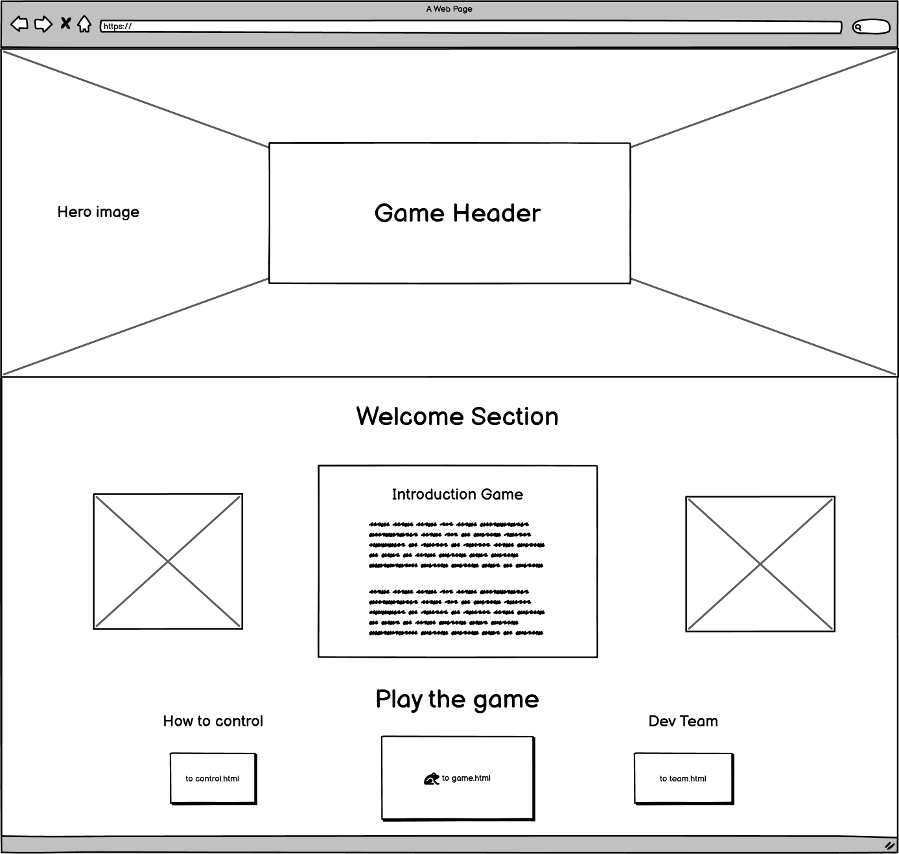

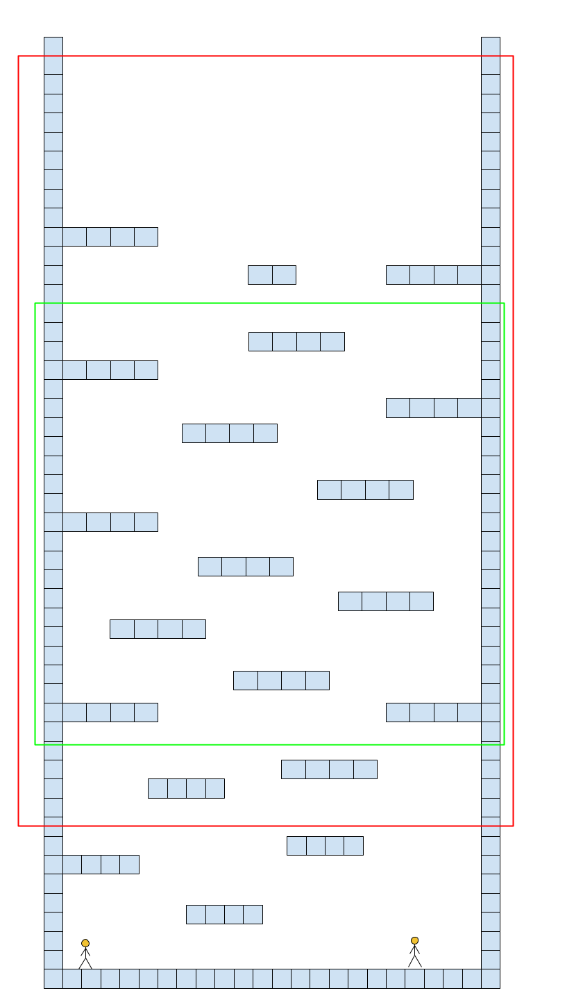
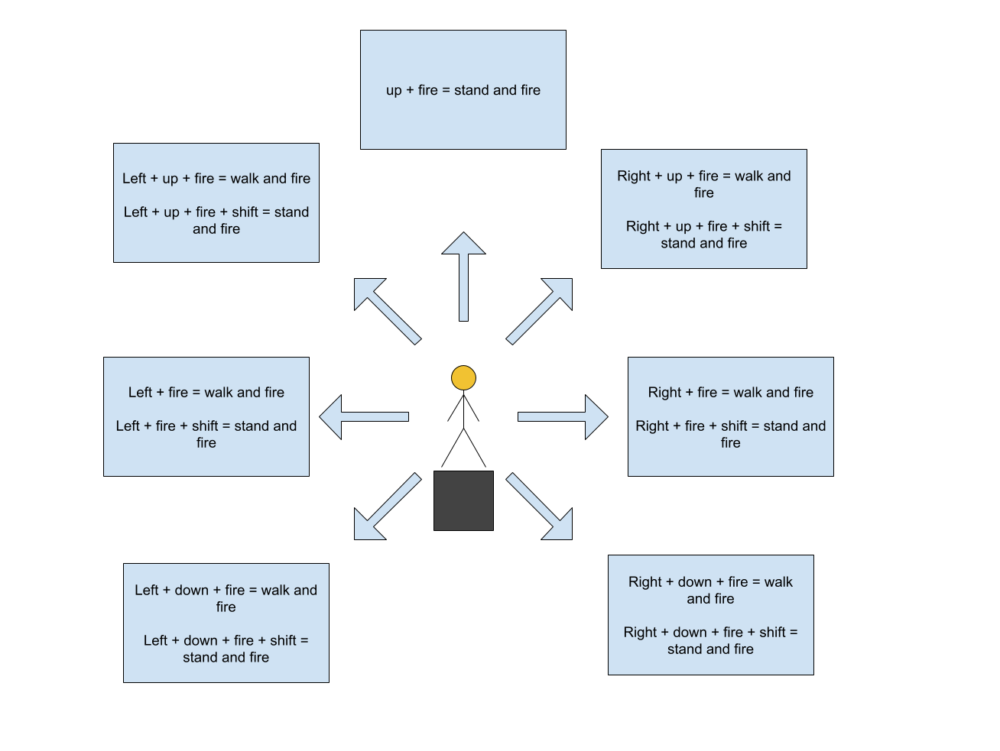
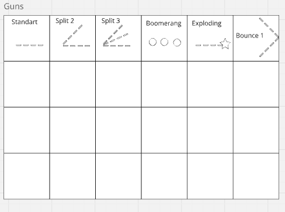
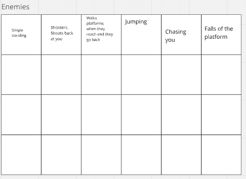
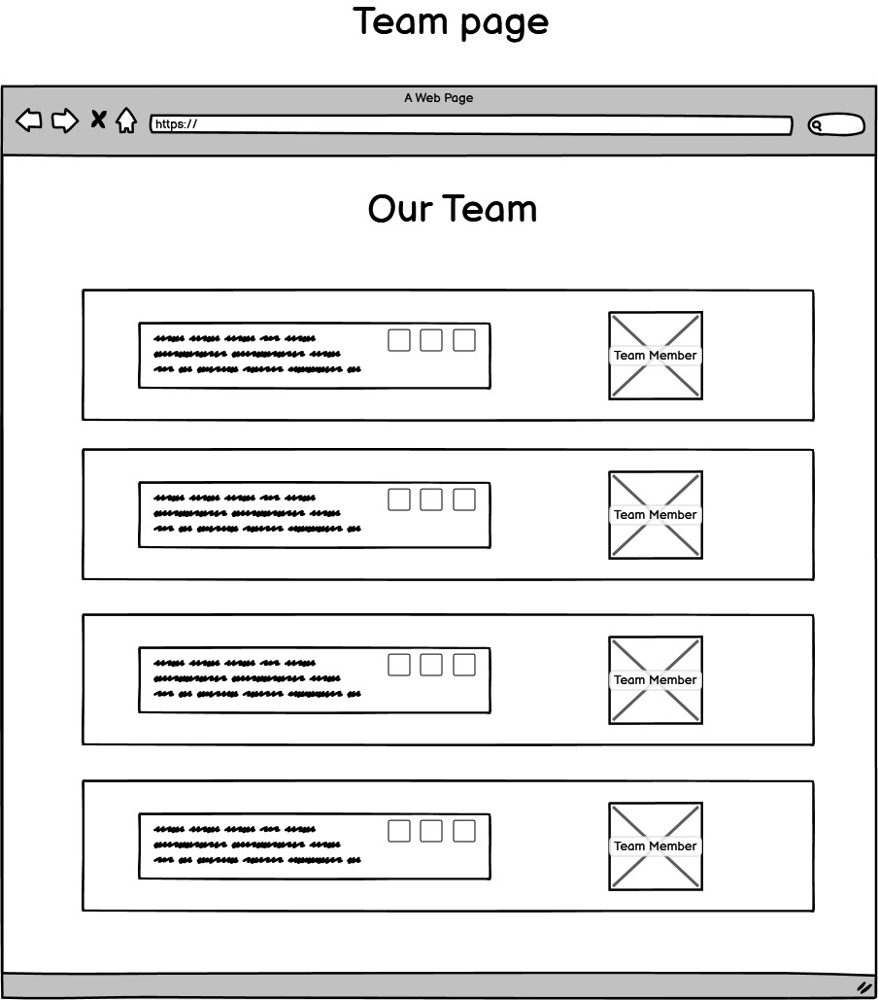

# Features

Welcome to "Frogs of Fury," where retro gaming meets relentless action. In this section, you'll discover everything that makes our game an exhilarating experience. From navigating the home screen to mastering the game mechanics, controlling your frog hero, and getting to know the team behind the game, we've got you covered. Dive in to explore the core features that bring "Frogs of Fury" to life and prepare yourself for an unforgettable adventure!

## Gameplay

"Frogs of Fury" is a thrilling retro game that brings back the intense action of classics like "Contra" with a unique twist. In this game, one or two players take control of fearless frogs, navigating an endless vertical map. The goal? To jump as high as possible while battling enemies and avoiding the rising danger from below.

- **Vertical Progression:** The game features an endless vertical map where players must leap from platform to platform, climbing ever higher. But beware, the map is slowly disintegrating from the bottom up, with deadly lava steadily rising. If you fall or take too long, the lava will catch up, so speed is of the essence.

- **Enemy Encounters:** As you ascend, you’ll face off against various enemies like snakes and mosquitoes. These foes become more challenging the higher you go, keeping you on your toes and adding to the game’s increasing difficulty.

- **Weapons and Power-Ups:** You start with a basic weapon, but by defeating enemies, you can unlock special weapons. Some enemies drop gadgets when defeated, which you can collect to upgrade your arsenal. Not every enemy will drop these power-ups, so you’ll need to strategize and make every shot count.

- **Rising Challenge:** The higher you climb, the tougher the game becomes. Platforms get smaller, enemies get stronger, and the lava rises faster. Quick reflexes and precise jumps are crucial if you want to survive and continue your ascent.

- **Co-op Mode:** In the 2-player mode, you can team up with a friend to face the challenges together. Cooperation is key, as you’ll need to support each other to overcome the increasingly difficult obstacles.

"Frogs of Fury" is all about testing your skills in a race against time and the ever-looming threat from below. Only the most agile and daring frogs will reach the top and earn their place in the "Frogs of Fury" hall of fame!

Gameplay screeenshots

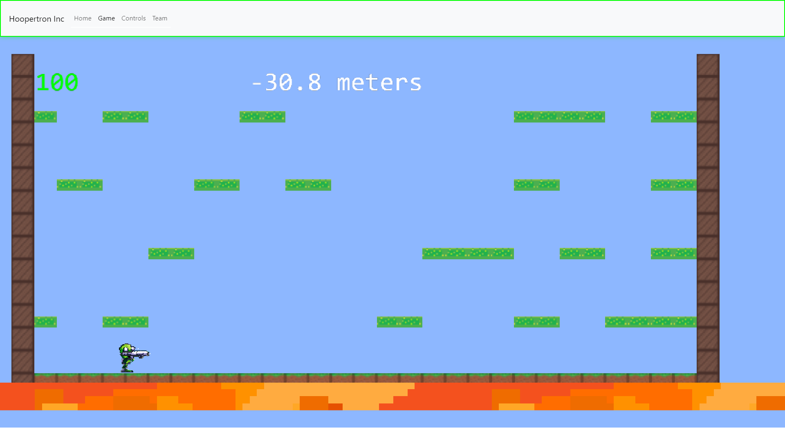
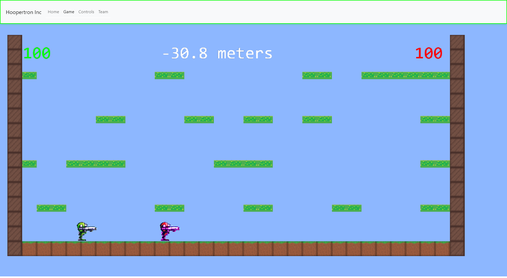
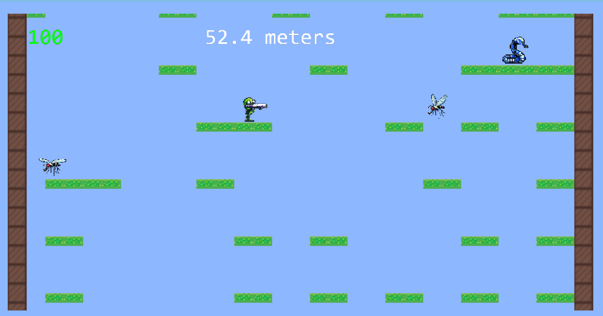

## Navigation

The navigation bar on the "Frog of Fury" website is designed for a seamless user experience, ensuring easy access to all key sections of the site. Located at the top of every page, it provides quick links to the Home, Game, Controls, and Team pages. The navbar features a collapsible menu for mobile users, maintaining a clean and organized look across all devices. With a subtle yet stylish design - using a semi-transparent white background, neon green borders, and a slight shadow effect - the navigation bar blends functionality with the game's retro aesthetic, making it easy for players to explore the game and related content.

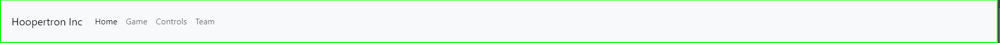
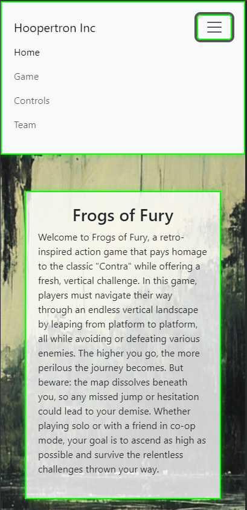

## Home Page

The "Home" page of "Frog of Fury" warmly welcomes all visitors and provides a quick introduction to the game. It sets the stage with a brief overview of the gameplay, highlighting the retro-inspired action and the thrilling vertical challenge. Two striking hero images featuring our Rambo Frog take center stage, capturing the essence of the game's intense vibe. From here, players can easily navigate to explore more about the development team, jump straight into the game, or get familiar with the controls and rules.

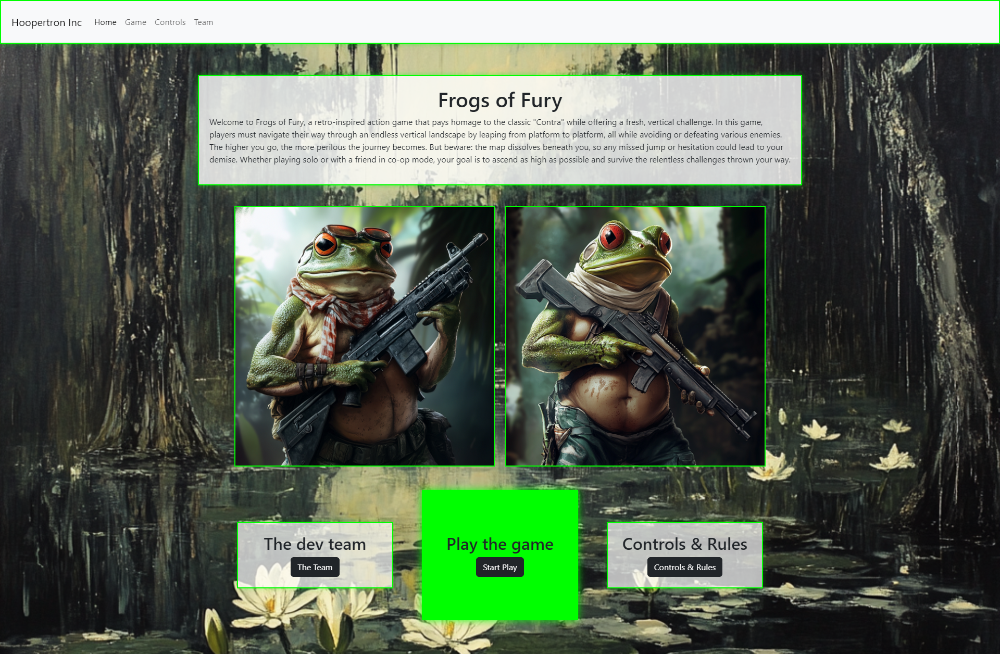

## Game Page

The "Game" page of "Frog of Fury" immerses players right from the start. Upon landing on this page, a modal window immediately pops up at the top of the screen, prompting the user to choose between single-player or two-player mode. Once the selection is made, the game map, along with the player character, appears, and the action begins. This straightforward setup allows players to quickly dive into the gameplay, ensuring an engaging and seamless start to their adventure.

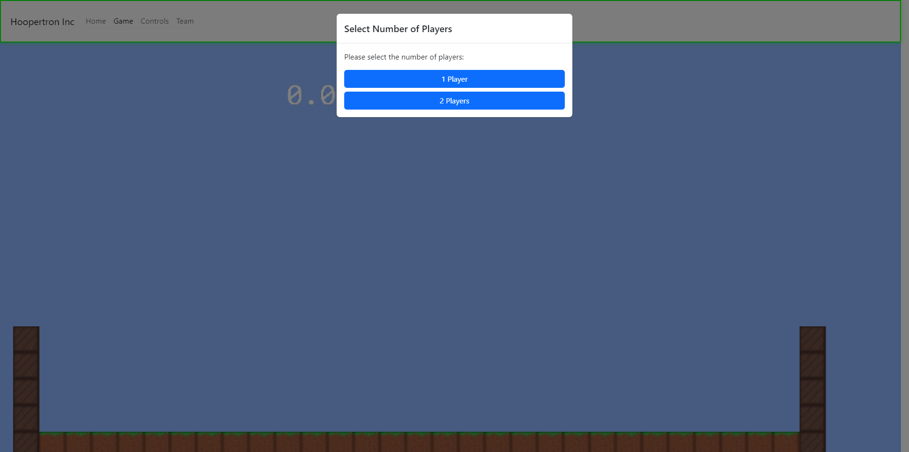

## Controls & Rules Page

### Controls

The "Controls" page is your go-to spot for setting up your game experience in "Frog of Fury." Here, you’ll find the default control keys, with the option to customize them to your liking. You can also adjust the music volume to suit your preference and save your settings. Plus, the game rules are laid out clearly, so you can quickly get up to speed before diving into the action.

### Player 1 Controls

- **Up**: `w`
- **Down**: `s`
- **Left**: `a`
- **Right**: `d`
- **Jump**: `c`
- **Shoot**: `v`
- **Volume up**: `]`
- **Volume down**: `[`

### Player 2 Controls

- **Up**: `o`
- **Down**: `l`
- **Left**: `k`
- **Right**: `;`
- **Jump**: `down arrow`
- **Shoot**: `left arrow`
- **Volume up**: `]`
- **Volume down**: `[`

### Rules of the game

1.  **Objective:** Ascend as high as possible by jumping from platform to platform. The higher you go, the tougher the enemies and the challenges.
2.  **Enemies:** Various enemies will try to stop your progress. Use different weapons to defeat them and clear your path upwards.
3.  **Falling:** If you miss a jump and fall off a platform, you can either land on a lower platform or fall into the abyss, leading to death.
4.  **Rising Abyss:** The abyss slowly rises from below, forcing you to keep moving upwards. Standing still for too long will result in being swallowed by the abyss.

Please refer to this section to understand how to control your characters and face the rules in the game.

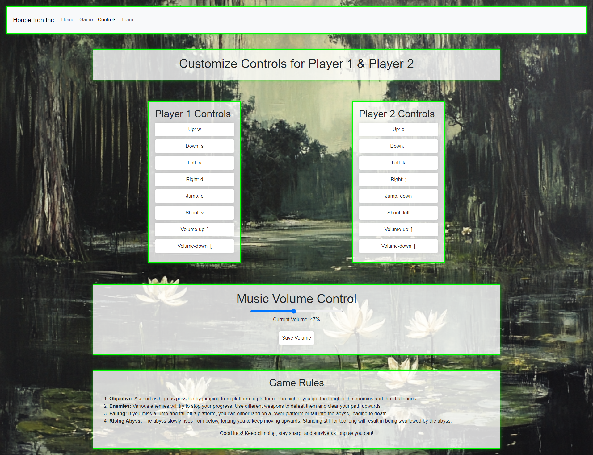

## Team Page

The "Team" page gives you a closer look at the people behind "Frog of Fury." Each team member is introduced with a brief bio, along with links to their GitHub and LinkedIn profiles. You'll also see a visual representation of their programming skills, making it easy to get a sense of the expertise that went into creating the game.

| Name               | Linkedin                                                                              | GitHub                                                                   |
| ------------------ | ------------------------------------------------------------------------------------- | ------------------------------------------------------------------------ |
| Erikas Ramanauskas | [Link to his Linkedin Profile]([https://www.linkedin.com/in/erikas-ramanauskas/](https://www.linkedin.com/in/erikas-ramanauskas-full-stack-developer/)       | [Link to his GitHub repositories](https://github.com/Erikas-Ramanauskas) |
| Kati Molnar        | [Link to her Linkedin Profile](https://www.linkedin.com/in/katalin-molnar-b6a694165/) | [Link to her GitHub repositories](https://github.com/molnarlin)          |
| Christian Borza    | [Link to his Linkedin Profile](https://www.linkedin.com/in/borzachristian/)           | [Link to his GitHub repositories](https://github.com/ChrisCross1983)     |
| John Hummel        | [Link to his Linkedin Profile](https://www.linkedin.com/in/jjohnhumm/)                | [Link to his GitHub repositories](https://github.com/Danger0101)         |

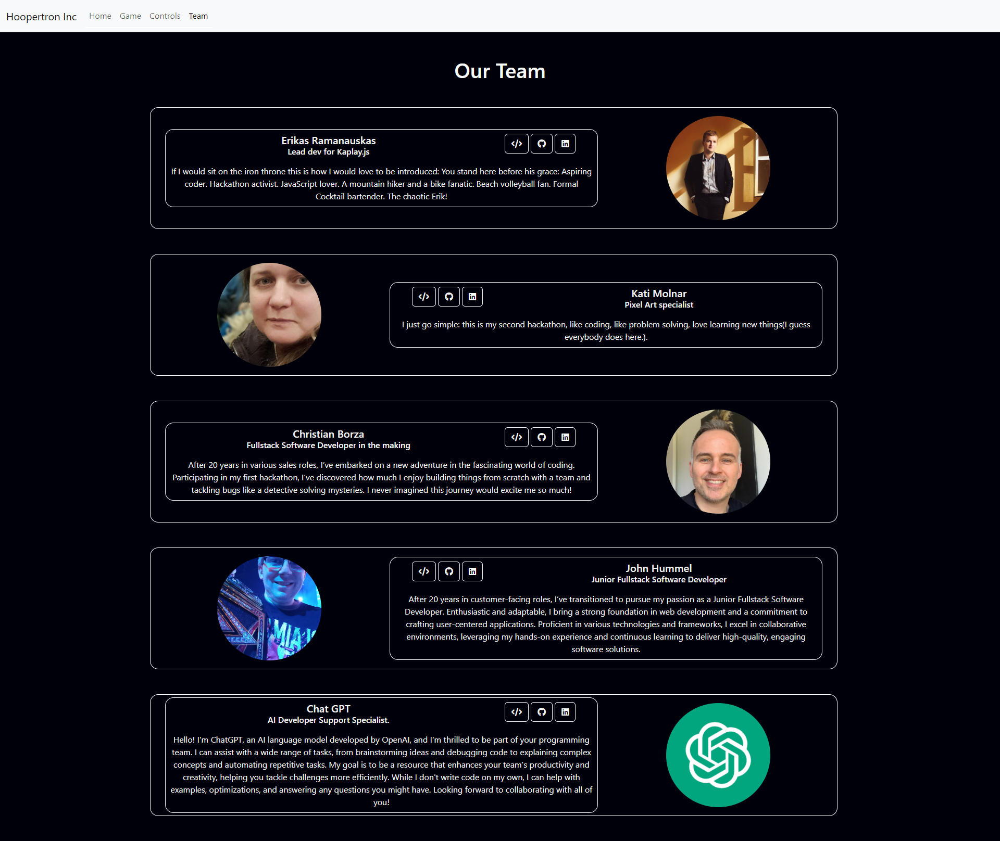

# Future Features
- **More tile types with unique effects**
- **More weapon options**
- **More Enemy types**
- **Enemies more advanced pathing**
- **Enemies target and shoot or attack players**
- **Health item pickups**
- **Other unique item pickups**
- **New and improved tile set**
- **Animating the Ai to change directions based on movement**
- **Add methods to pause the game to change controls or take a short break**

# Technologies Used

### Languages used

- HTML
- CSS
- JavaScript

### Frameworks, Libaries & Programs used

1. Generated images for graphics with MS Copilot.
2. Edited the images to a spritesheet with MS Paint.
3. Converted and corrected the images to pixel art with [Pixilart.com](https://www.pixilart.com).
4. Inspiration and help to create readable text with [ChatGPT](https://chatgpt.com/)
5. Converted images to webp format with [ConvertCloud](https://cloudconvert.com/)
6. Created a repository and deployed the live project with [GitHub](https://github.com/)
7. Content for set up the basic gameplay taken form [kaplayjs](https://kaplayjs.com/)

### Collaborative tools

1. Agile project management organisation using [trello](https://trello.com/)
2. Agile project management visualisation using [miro](https://miro.com/)
3. Sharing files with [goole drive](https://drive.google.com/)
4. For the daily project communication, sharing screens for problem solving etc. using [Slack](https://slack.com/)

# Deployment

## Project Deployment via GitHub

The Frogs of Fury repository is stored on GitHub. The site was created using GitPod and the live site is hosted on GitHub Pages. This is a guide to deploying a site on GitHub Pages using GitHub.

1. Sign in to GitHub and find the repository in the repositories menu.
2. Click to open the repository and click on the settings icon to open the settings menu for the repository.
3. In the settings menu, click on the pages tab on the left side of the screen.
4. Under source, select branch: main, leave the folder on the root, and click save.
5. The page will then automatically refresh and provide a link to the published site when it has finished processing.

The live link for Frogs of Fury can be found here - [Link to deployed live site](https://erikas-ramanauskas.github.io/team_9_august_2024/)

## How to fork a repository via GitHub

A copy of a local GitHub repository can be made by forking the GitHub repository. The purpose of this is to allow changes to be made to the copy without affecting the original repository. This is a guide to forking a repository on GitHub.

1. Sign in to GitHub, locate the repository, and click to open the repository.
2. On the right-hand side of the repository menu there is a button called fork. Click the button to make a copy of the repository into your GitHub account.

## How to create a local clone of a project

This is a guide on how to clone a repository from GitHub.

1. Sign in to GitHub, locate the repository, and click to open the repository.
2. On the repository main page, click the code button above where the files are located. This will open a drop-down menu.
3. In the dropdown menu stay on the HTTPS option and click the copy icon button next to the URL to copy it.
4. Now minimize/close your browser and open your local IDE, e.g. Visual Studio Code or Brackets.
5. Open Git Bash and change the current working directory to the file location you want the cloned directory to be made.
6. Type git clone into the command line and then paste the URL copied from GitHub.
7. Press enter and the local repository clone will be created.

# Testing

## Responsive Testing

"Frogs of Fury" is designed primarily for desktop play with a keyboard, providing the best experience when used in this setup. While the game can technically be accessed on mobile devices, the gameplay might not be fully optimized for touch controls, and players could encounter difficulties navigating and performing actions. For an optimal experience on mobile, it's recommended to connect a keyboard to your smartphone. This way, you can enjoy the game as intended, with the full range of controls and responsiveness.

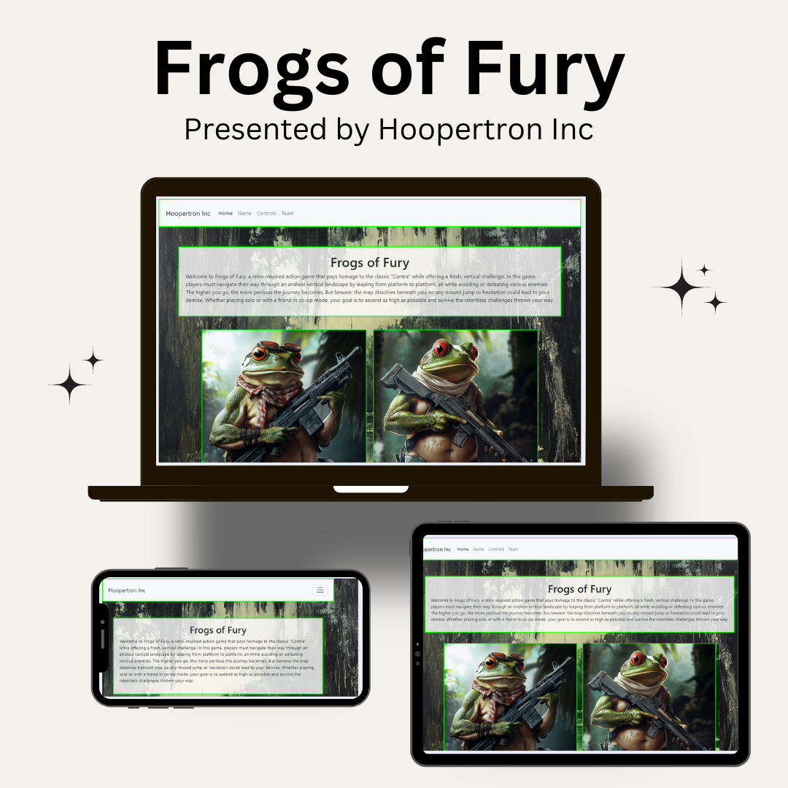

## Manual Testing

**1. Test Plan Table for Microsoft Edge on Desktop for Home page**
**********
|Test| User requirement addressed | Expected result | Actual result | Pass / Fail | Date | Corrective Action
|--------------:|:--------------------------:|:---------------:|:-------------:|:-----------:|:----:|:-----------------
|Nav-bar appears|Website is easy to navigate|Nav-bar appears|As expected|Pass|19/08/24|None
|Nav-bar hyperlinks work|Website is easy to navigate|When you move the mouse over, it will become green and underlined.|As expected|Pass|19/08/24|None
|Text appears|Text is visible|Text is readable|As expected|Pass|19/08/24|None
|Card appears|Card is visible|Card appears|As expected|Pass|19/08/24|None
|Pictures render|Pictures are visible|Pictures are next to eachother|As expected|Pass|19/08/24|None
|Card button appears|Website is easy to navigate|When you move the mouse over the button, it will become brighter.|As expected|Pass|19/08/24|None
|Card button works|Website is easy to navigate|Button is clickable|As expected|Pass|19/08/24|None
*************************************
**Test Plan Table for Microsoft Edge on Desktop for Game page**
****************
|Test| User requirement addressed | Expected result | Actual result | Pass / Fail | Date | Corrective Action
|--------------:|:--------------------------:|:---------------:|:-------------:|:-----------:|:----:|:-----------------
|Alert appears|It's easy to navigate|Alert appears|As expected|Pass|19/08/24|None
|Alert buttons appear |Website is easy to navigate|When you move the mouse over the button, the text is darker.|As expected|Pass|19/08/24|None
|Alert buttons works|Website is easy to navigate|Button is clickable|As expected|Pass|19/08/24|None
*************************************
**Test Plan Table for Microsoft Edge on Desktop for Controls page**
****************
|Test| User requirement addressed | Expected result | Actual result | Pass / Fail | Date | Corrective Action
|--------------:|:--------------------------:|:---------------:|:-------------:|:-----------:|:----:|:-----------------
|Nav-bar appears|Website is easy to navigate|Nav-bar appears|As expected|Pass|19/08/24|None
|Nav-bar hyperlinks work|Website is easy to navigate|When you move the mouse over, it will become green and underlined.|As expected|Pass|19/08/24|None
|Text appears|Text is visible|Text is readable|As expected|Pass|19/08/24|None
|Buttons appear|Website is easy to navigate|When you move the mouse over the button, it will become darker.|As expected|Pass|19/08/24|None
|Buttons work|Website is easy to navigate|Button is clickable, modals appear|As expected|Pass|19/08/24|None
|Music volume control bar appears|Website is easy to navigate|Control bar appears|As expected|Pass|19/08/24|None
|Music volume control bar works|Website is easy to navigate|Control bar change the volume of the music|As expected|Pass|19/08/24|None
|Save Button appears|Website is easy to navigate|When you move the mouse over the button, it will become darker.|As expected|Pass|19/08/24|None
|Save Button works|Website is easy to navigate|Button is clickable, modals appear|As expected|Pass|19/08/24|None
*************************************
**Test Plan Table for Microsoft Edge on Desktop for Team page**
****************
|Test| User requirement addressed | Expected result | Actual result | Pass / Fail | Date | Corrective Action
|--------------:|:--------------------------:|:---------------:|:-------------:|:-----------:|:----:|:-----------------
|Nav-bar appears|Website is easy to navigate|Nav-bar appears|As expected|Pass|19/08/24|None
|Nav-bar hyperlinks work|Website is easy to navigate|When you move the mouse over, it will become green and underlined.|As expected|Pass|19/08/24|None
|Text appears|Text is visible|Text is readable|As expected|Pass|19/08/24|None
|Buttons appear|Website is easy to navigate|When you move the mouse over the button, it will become white.|As expected|Pass|19/08/24|None
|Buttons work|Website is easy to navigate|Button is clickable|As expected|Pass|19/08/24|None
*************************************

**2. Test Plan Table for Google Chrome on Desktop for Home page**
**********
|Test| User requirement addressed | Expected result | Actual result | Pass / Fail | Date | Corrective Action
|--------------:|:--------------------------:|:---------------:|:-------------:|:-----------:|:----:|:-----------------
|Nav-bar appears|Website is easy to navigate|Nav-bar appears|As expected|Pass|19/08/24|None
|Nav-bar hyperlinks work|Website is easy to navigate|When you move the mouse over, it will become green and underlined.|As expected|Pass|19/08/24|None
|Text appears|Text is visible|Text is readable|As expected|Pass|19/08/24|None
|Card appears|Card is visible|Card appears|As expected|Pass|19/08/24|None
|Pictures render|Pictures are visible|Pictures are next to eachother|As expected|Pass|19/08/24|None
|Card button appears|Website is easy to navigate|When you move the mouse over the button, it will become brighter.|As expected|Pass|19/08/24|None
|Card button works|Website is easy to navigate|Button is clickable|As expected|Pass|19/08/24|None
*************************************
**Test Plan Table for Google Chrome on Desktop for Game page**
****************
|Test| User requirement addressed | Expected result | Actual result | Pass / Fail | Date | Corrective Action
|--------------:|:--------------------------:|:---------------:|:-------------:|:-----------:|:----:|:-----------------
|Alert appears|It's easy to navigate|Alert appears|As expected|Pass|19/08/24|None
|Alert buttons appears|Website is easy to navigate|When you move the mouse over the button, text is darker.|As expected|Pass|19/08/24|None
|Alert buttons works|Website is easy to navigate|Button is clickable|As expected|Pass|19/08/24|None
*************************************
**Test Plan Table for Google Chrome on Desktop for Controls page**
****************
|Test| User requirement addressed | Expected result | Actual result | Pass / Fail | Date | Corrective Action
|--------------:|:--------------------------:|:---------------:|:-------------:|:-----------:|:----:|:-----------------
|Nav-bar appears|Website is easy to navigate|Nav-bar appears|As expected|Pass|19/08/24|None
|Nav-bar hyperlinks work|Website is easy to navigate|When you move the mouse over, it will become green and underlined.|As expected|Pass|19/08/24|None
|Text appears|Text is visible|Text is readable|As expected|Pass|19/08/24|None
|Buttons appear|Website is easy to navigate|When you move the mouse over the button, it will become darker.|As expected|Pass|19/08/24|None
|Buttons work|Website is easy to navigate|Button is clickable, modals appear|As expected|Pass|19/08/24|None
|Music volume control bar appears|Website is easy to navigate|Control bar appears|As expected|Pass|19/08/24|None
|Music volume control bar works|Website is easy to navigate|Control bar change the volume of the music|As expected|Pass|19/08/24|None
|Save Button appears|Website is easy to navigate|When you move the mouse over the button, it will become darker.|As expected|Pass|19/08/24|None
|Save Button works|Website is easy to navigate|Button is clickable, modals appear|As expected|Pass|19/08/24|None
*************************************
**Test Plan Table for Google Chrome on Desktop for Team page**
****************
|Test| User requirement addressed | Expected result | Actual result | Pass / Fail | Date | Corrective Action
|--------------:|:--------------------------:|:---------------:|:-------------:|:-----------:|:----:|:-----------------
|Nav-bar appears|Website is easy to navigate|Nav-bar appears|As expected|Pass|19/08/24|None
|Nav-bar hyperlinks work|Website is easy to navigate|When you move the mouse over, it will become green and underlined.|As expected|Pass|19/08/24|None
|Text appears|Text is visible|Text is readable|As expected|Pass|19/08/24|None
|Buttons appear|Website is easy to navigate|When you move the mouse over the button, it will become white.|As expected|Pass|19/08/24|None
|Buttons work|Website is easy to navigate|Button is clickable|As expected|Pass|19/08/24|None
*************************************

# Bugs

## Solved Bugs
- **Sound not playing**
- **Lava not killing enemies**
- **Lava not killing players**
- **Bullets not moving**
- **Bullets double ricocheting**
- **Map not deleting correctly below player**
- **Map not created above the player**
- **Platforms not spawning as intended (single platforms and no multiple platforms on map)**
- **Game tiles were too large**
- **Rocket explosion deals no damage**
- **Rockets destroyed when hitting enemies so no AOE**
- **Multiple sprites of players on restart**

## Unsolved Bugs
- **Game needs to be clicked after initiation**
- **Pop-up disappears and can't be opened once gone to select player count.**
- **Volume controls crash game**

# Credits

## Media

### Pictures

- Styling the team banner with [canva](https://www.canva.com/) 

### Effects and sounds

- [soundsnap](https://www.soundsnap.com/) - Effects in the gameplay
- [uppbeat](https://www.uppbeat.io/) - Background music
- [jsfxr](https://www.sfxr.me/) - Sound effects in the gameplay
- [fesliyanstudios](https://www.fesliyanstudios.com/) - Background music

### Video tutorial

- How to [Tutorial how to use kaplayjs JavaScript](https://www.youtube.com/watch?v=FdEYxGoy5_c)
- How to [Convert an image to pixel art](https://www.youtube.com/watch?v=ijp2TqR2x2A)

# Acknowledgments

A big shoutout to the amazing team that brought "Frogs of Fury" to life during this Hackathon! Kati, John, Erikas, and Chris - what a wild ride it’s been! From late-night coding sessions to endless cups of coffee, we've tackled every challenge with humor and determination.

It’s been a whirlwind of ideas, laughter, and a few too many bugs, but we made it through as a team. Thanks to everyone for their hard work, creativity, and the occasional meme that kept our spirits high. Here's to more late nights and epic games in the future!
